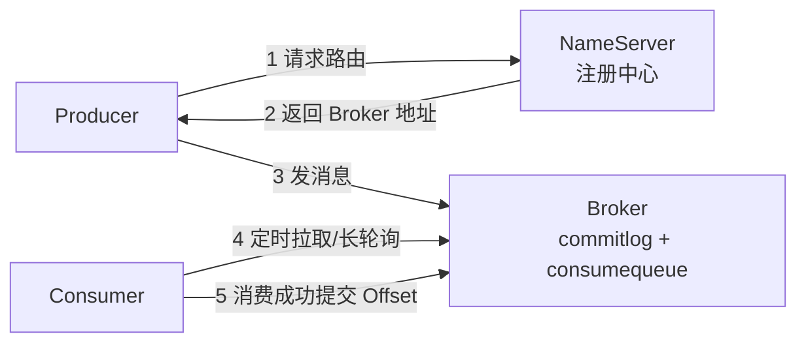

# RocketMQ 学习笔记 · 第 0 课：框架下面的底层骨架

> 目的：在碰 Spring 框架代码之前，先看清 RocketMQ 原生是怎么工作的。
> 方法：不写代码，直接观察已经搭好的真实环境（192.168.200.128 虚拟机）。

## 0. 你环境里有什么（实测）

虚拟机 `192.168.200.128` 上用 Docker 跑着（RocketMQ 5.2.0）：

| 容器 | 作用 | 端口 |
| --- | --- | --- |
| rmqnamesrv | NameServer：注册中心，管路由 | 9876 |
| rmqbroker | Broker：存储 + 读写消息 | 10909 / 10911 / 10912 |
| rocketmq-dashboard | 管理控制台 | 8080 |

Broker 关键配置（`conf/broker.conf`）：

```ini
brokerClusterName = DefaultCluster
brokerName = broker-a
brokerId = 0            # 0 = Master；非 0 = Slave
brokerRole = ASYNC_MASTER
flushDiskType = ASYNC_FLUSH
brokerIP1 = 192.168.200.128   # 对外公布的地址，客户端连这个
autoCreateTopicEnable = true  # 发送时 Topic 不存在会自动创建
```

`mqadmin clusterList` 实测结果：集群 `DefaultCluster` 只有 1 个 Broker `broker-a`，
地址 `192.168.200.128:10911`，Master（BID=0），版本 V5_2_0。

## 1. 架构总览：四个角色、一条消息的路径



关键理解：

- NameServer 只做"路由表"：Broker 启动时注册自己，Producer/Consumer 定时拉取路由；
- 消息真正的家是 Broker 的磁盘，不在内存；
- Consumer 表面叫 Push，底层其实是 Pull + 长轮询（默认 15s 挂起等待），
  PushConsumer 只是把"拉 + 回调 + 提交位点"封装好了。

## 2. 你的框架代码，真身是什么

`rocketmq-spring-boot-starter` 只是把原生客户端包了一层 Spring 壳：

**生产者**：`RocketMQTemplate.convertAndSend(...)` 背后 ≈

```java
DefaultMQProducer producer = new DefaultMQProducer("demo-producer-group");
producer.setNamesrvAddr("192.168.200.128:9876");
producer.start();                          // 1. 启动（连接 NameServer 拿路由）
SendResult result = producer.send(msg);    // 2. 发消息（同步）
producer.shutdown();                       // 3. 释放
```

**消费者**：`@RocketMQMessageListener + RocketMQListener` 背后 ≈

```java
DefaultMQPushConsumer consumer = new DefaultMQPushConsumer("demo-consumer-group");
consumer.setNamesrvAddr("192.168.200.128:9876");
consumer.subscribe("rocket-service-exm", "*");   // 1. 订阅 Topic + Tag
consumer.registerMessageListener((MessageListenerConcurrently) (msgs, ctx) -> {
    System.out.println("msg is : " + new String(msgs.get(0).getBody()));
    return ConsumeConcurrentlyStatus.CONSUME_SUCCESS;  // 2. 消费回调
});
consumer.start();                                // 3. 启动（自动拉取 + 提交 Offset）
```

所以框架代码只是把 `start() / send() / subscribe() / registerMessageListener() /
start()` 这组固定动作搬到了注解和 Bean 里。看懂原生这 4 步，框架就没魔法了。

## 3. 消息在磁盘上的真实样子（实测）

Broker 存储根目录 `/home/rocketmq/store`：

```text
store/
├── commitlog/          # 消息本体，顺序追加；单个文件上限 1GB
│   └── 00000000000000000000   # 实测正好 1073741824 字节
├── consumequeue/       # 逻辑队列索引，按 Topic/Queue 分目录
│   └── MINI_PAYMENT_EVENT/
│       ├── 0/          # Queue 0
│       ├── 1/          # Queue 1
│       ├── 2/          # Queue 2
│       └── 3/          # Queue 3
├── index/              # 按 Key/时间查消息的索引
├── config/             # 元数据：Topic、消费位点、订阅组
│   ├── topics.json
│   ├── consumerOffset.json
│   └── subscriptionGroup.json
├── abort               # 上次是否正常关闭的标记
└── checkpoint
```

两个最核心的文件：

1. **commitlog**：所有 Topic 的消息都顺序写进这一个文件（队列尾部追加），
   这是 RocketMQ 高性能的根基——顺序写磁盘；
2. **consumequeue**：按 `Topic/Queue` 生成的索引，每 20 条消息一个条目，
   记录消息在 commitlog 里的位置，消费时按这个索引去取。

## 4. 消费位点（Offset）真实数据解读

`config/consumerOffset.json` 里的实测片段：

```json
"MINI_PAYMENT_EVENT@mini-payment-consumer": {0:5, 1:6, 2:6, 3:5},
"chain-result-topic@chain-group": {0:2, 1:0, 2:6, 3:3}
```

含义：

- 一个消费组在每个 Queue 上**各自维护一个 Offset**；
- 同一个 Topic 被多个消费组消费时，各自记各自的进度，互不影响——这就是
  "集群内负载均衡、组间广播"的物理基础；
- 4 个 Queue 意味着最多 4 个消费线程/实例并行消费（组内实例会平分 Queue）。

## 4.5 Offset 到底是什么（详解）

把每个 Queue 想成一列**编号从 0 开始的消息格子**，消费组手里拿着一张"书签"
（Offset），标记"下一条该读哪一格"。

拿 `MINI_PAYMENT_EVENT@mini-payment-consumer` 的 Queue 0 为例，offset = 5：

```text
Queue 0:  [0][1][2][3][4] |书签→  [5][6][7][8]...
          └── 已消费 ──┘          └── 还没读 ──┘
```

整行 JSON 翻译成人话：

| 队列 | Offset | 意思 |
| --- | --- | --- |
| Queue 0 | 5 | 0~4 已消费，下一条读 5 |
| Queue 1 | 6 | 0~5 已消费，下一条读 6 |
| Queue 2 | 6 | 0~5 已消费，下一条读 6 |
| Queue 3 | 5 | 0~4 已消费，下一条读 5 |

再看 `chain-result-topic@chain-group`: {0:2, 1:0, 2:6, 3:3}：

- Queue 1 的 offset 是 **0**：一条都没消费过（消息没被发到过这个队列，
  或这个组的消费实例还没被分配到它）；
- Queue 2 已经消费了 6 条。

为什么各队列进度不一样？因为生产者发消息时按**轮询 / 随机 / Key 哈希**选队列，
消息天然分布不均；消费时组内实例平分队列，每个队列各自独立推进。

两个容易踩的认知坑：

1. **Offset 是"队内位置"，不是全局消息编号**。Queue 0 里的 0~5 和 Queue 1 里的
   0~5 是完全不同的消息，所以两边 offset 数值没有可比性；
2. **Offset 是"每个消费组一份"**。两个组消费同一个 Topic，各自记各自的进度，
   互不影响——这正是"组间广播"的物理基础。

Offset 怎么变化：

- 消费成功 → 提交新 Offset（旧值 + 消费条数）→ 书签前进；
- 消费失败 → 不提交 → Offset 不动 → 这条消息下次还会被投递。
  **这就是"至少一次投递"的由来**，也解释了为什么重复消费要靠幂等兜底。

能算出什么：堆积量 = 队列写到了哪（maxOffset）− 消费进度（offset）。
Dashboard 里"堆积数"就是这两个数的差。

验证题：按上面的规则，`MINI_PAYMENT_EVENT` 已经被 `mini-payment-consumer`
消费了多少条？答案：5+6+6+5 = 22 条（因为从 0 开始，offset 值 = 已消费条数）。

## 5. 意外收获：Broker 里的"系统主题"

`topics.json` 里除了业务 Topic（MINI_PAYMENT_EVENT、order-close-topic 等），还有：

| 系统主题 | 用途 | 后续课程 |
| --- | --- | --- |
| `%RETRY%消费组名` | 消费失败后的重试队列（每组 1 个队列） | 第 3 / 7 课 |
| `%DLQ%消费组名` | 死信队列（重试耗尽） | 第 7 课 |
| `SCHEDULE_TOPIC_XXXX` | 延迟消息（18 个队列对应 18 个延迟级别） | 第 6 课 |
| `RMQ_SYS_TRANS_HALF_TOPIC` / `RMQ_SYS_TRANS_OP_HALF_TOPIC` | 事务消息半消息 | 第 5 课 |
| `RMQ_SYS_TRACE_TOPIC` | 消息轨迹 | 第 7 课 |
| `TBW102` | 自动创建 Topic 的模板（8 队列） | 第 2 课 |

另外注意到：consumequeue 里**没有** `rocket-mail-topic`——你的项目还没向这台
Broker 真正发过消息；因为开了 `autoCreateTopicEnable`，第一次发送时才会创建。

## 6. 不用写代码就能做的动手验证

1. 打开 `http://192.168.200.128:8080`（rocketmq-dashboard），
   看 Topic 列表、消费组、消息查询，和上面 JSON 里的数据对得上；
2. 在 dashboard 里给某个 Topic 发一条测试消息，然后去查消息、看它的 offset；
3. 在 dashboard 的"消费者"页看各消费组当前消费位点和堆积量；
4. 对着 `consumerOffset.json` 刷新前后对比，观察 Offset 变化。

## 7. 本节小结（三句话）

- RocketMQ = NameServer（路由） + Broker（存储） + 客户端（原生 Producer/Consumer）；
- 框架只是把原生客户端的固定 4 步动作装进了 Spring 注解；
- 消息在磁盘上是"commitlog 顺序写 + consumequeue 建索引"，Offset 按
  `Topic@Group + Queue` 维护。
