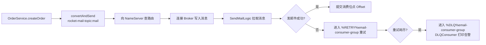

# RocketMQ 学习笔记 · 第 1 课：从你的项目认识消息队列

> 项目位置：`three-major-mq-service/rocketmq-service`
> 学习方式：概念 + 读代码 + 动手改代码，一课一个主题

## 总体学习路线图（8 课）

| 阶段 | 主题 | 对应代码 / 练习 |
| --- | --- | --- |
| 1 | 消息模型入门：Producer / Consumer / Topic / Tag / Group / 生命周期 | 现有订单发邮件 Demo |
| 2 | 消息模型深入：Queue、Offset、消费模式、RocketMQTemplate API 全解 | 自己加延迟消息、带 keys 的消息 |
| 3 | 可靠性：发送重试、Broker 存储、消费重试、消息丢失排查、幂等 | 模拟发送失败 / 消费失败 |
| 4 | 顺序消息：局部有序、MessageQueueSelector | 转账流水、订单状态机 Demo |
| 5 | 事务消息：半消息、回查、本地事务表、最终一致性 | 订单 + 库存 Demo |
| 6 | 延迟消息、定时消息、消息过滤（Tag / SQL92） | 延迟关单 Demo |
| 7 | 重试队列与死信队列深入、消息轨迹、RocketMQ Dashboard | 完整失败链路演练 |
| 8 | 集群部署：NameServer 集群、主从、存储机制、刷盘策略、高可用、消息积压治理 | 部署 + 压测 |

学完 RocketMQ 后再按同样思路推进 `rabbitmq-service`、`kafka-service`，最后横向对比三大 MQ。

---

## 第 1 课正文

### 1. MQ 解决什么问题（用你的代码说话）

`OrderService.createOrder()` 只做两件事：

1. 打印"订单已创建"（模拟业务）；
2. `rocketMQTemplate.convertAndSend("rocket-mail-topic:mail", msgBody)` 把发邮件这件事丢给 MQ，主线程立刻返回。

这就是 MQ 的第一个价值：**异步解耦**。下单流程不用等邮件发完（邮件可能慢、可能失败），
主流程和邮件流程之间只靠一条消息耦合，互不阻塞、互不影响。

其他两个价值后续会反复用到：

- **削峰填谷**：突发流量先进 MQ，消费者按自己的速度慢慢消费；
- **广播分发**：同一份消息可以同时被多个消费组各自消费（后面讲）。

### 2. RocketMQ 核心角色 ↔ 你的代码映射

| 概念 | 一句话解释 | 你项目里的体现 |
| --- | --- | --- |
| NameServer | 注册中心，管 Broker 的路由信息（类似 Eureka） | `application.yml` 里 `rocketmq.name-server: 192.168.200.128:9876` |
| Broker | 真正存消息、提供读写服务的节点 | 你 VM 上跑的 RocketMQ Broker |
| Producer | 发消息的一方 | `ProduceRockerMQDEM`、`OrderService` |
| Consumer | 收消息并处理的一方 | `ConsumerRocketMQDEML`、`SendMailLogic`、`DLQConsumer` |
| Topic | 消息的逻辑分类，一个 Topic 下有很多 Queue | `rocket-service-exm`、`rocket-mail-topic` |
| Tag | Topic 内的二级标签，用于过滤 | `rocket-mail-topic:mail` 里的 `mail` |
| ConsumerGroup | 一组消费者的集合，组内做负载均衡 | `demo-consumer-group`、`email-consumer-group` |
| Message | 一条消息（body + tag + key + 各种属性） | 你发的 `Map`（email / content / sendTimestamp） |
| Queue / Offset | 消息真正排队的地方 / 消费进度指针 | 默认每个 Topic 4 个写队列、4 个读队列 |
| DLQ | 死信队列，重试耗尽后的归宿 | `%DLQ%email-consumer-group` |

### 3. 一条消息的完整生命周期

以 `/order/send` 链路为例：

几个关键细节：

- `convertAndSend("rocket-mail-topic:mail", msgBody)` 里 `topic:tag` 是 rocketmq-spring
  的约定写法，冒号前是 Topic，冒号后是 Tag；
- 你发的是 `Map`，底层 `RocketMQTemplate` 会用 Jackson 序列化成 JSON，
  消费者 `RocketMQListener<Map<String,String>>` 再反序列化回来；
- `SendMailLogic` 里用 `sendTimestamp` 和 `receiveTimestamp` 算的差值，
  就是"消息在 MQ 里排队 + 传输"的耗时，这是最简单的链路监控手段。

### 4. 三个最容易混的概念

**Topic vs Tag vs Queue**

- Topic：业务分类（订单消息 / 邮件消息）；
- Tag：Topic 内更细的分类（邮件里的"下单通知"、"营销邮件"），消费者可以只订阅感兴趣的 Tag；
- Queue：Topic 下真正存储消息的队列，是并行与顺序的底层单位。

**集群消费 vs 广播消费**

- 同一个 ConsumerGroup 下多个实例：消息被**平分**（负载均衡，一条消息只被一个实例消费）——默认模式；
- 不同 ConsumerGroup：**各消费各的**，一条消息每个组都能收到；
- 广播模式：组内每个实例都收到全量消息（`@RocketMQMessageListener` 里 `consumeMode = ConsumeMode.BROADCASTING`）。

**重试次数语义**

`ConsumerRocketMQDEML` 里写了 `maxReconsumeTimes = 1`，意思是失败后**再重试 1 次**，
也就是说一条消息最多被消费 2 次。默认值是 16。重试期间消息进 `%RETRY%组名`，耗尽后进 `%DLQ%组名`。

### 5. 代码里值得注意的点（建议改）

1. **安全**：`application.yml` 里写死了 163 邮箱授权码，等于把邮箱控制权暴露在仓库里。
   建议尽快去 163 后台重置授权码，并改用环境变量注入（`${MAIL_PASSWORD}`）。
2. **编码**：Java 源码是 GBK 编码，IDE 里看中文正常但换环境容易乱码，建议统一转成 UTF-8。
3. `@Import(RocketMQAutoConfiguration.class)` 在 starter 2.3.5 里通常冗余，`@SpringBootApplication`
   会自动装配。
4. `DLQConsumer` 现在只打印日志，真实项目里应该告警 + 落库 + 人工/自动重放。
5. 邮件密码属于机密，`.gitignore` 应该排除配置；`rocketmq-service` 目前没有 `.gitignore`。

### 6. 动手验证（建议照着做一遍）

1. 启动 RocketMQ：NameServer（9876 端口）+ Broker，并确认 Broker 注册到
   `192.168.200.128:9876`；
2. 启动 `RocketMqApplication`（端口 18082）；
3. 浏览器访问 `http://localhost:18082/send`，看控制台 `msg is : hello rocketmq`；
4. 用 Postman 调 `POST /order/send`，body 填 `{"email":"你的邮箱","orderId":"NO-001"}`，
   观察 `SendMailLogic` 打印的链路延迟、业务耗时，以及邮箱是否收到信；
5. 故意让 `SendMailLogic.onMessage` 抛异常，观察消息进 `%RETRY%`，重试耗尽后
   `DLQConsumer` 是否打印。

### 7. 课后练习（下次上课前完成）

1. 在 `OrderService` 里改用 `syncSend` 并传 `keys`，消费端打印 `msgId`、`keys`、`tags`；
2. 用 `convertAndSend("topic:tagA", ...)` 和 `selectorExpression = "tagA"` 验证 Tag 过滤；
3. 给 `@RocketMQMessageListener` 加上 `consumeMode`，体验广播消费；
4. 想清楚一个问题：**为什么说"RocketMQ 默认至少一次投递"？重复消费时你该怎么幂等？**

---

下一课预告：**消息模型深入**——Queue 与 Offset 到底怎么工作、消费组负载均衡算法、
`RocketMQTemplate` 常用 API（syncSend / asyncSend / oneway / sendOrderly / delayLevel）逐个拆解。
